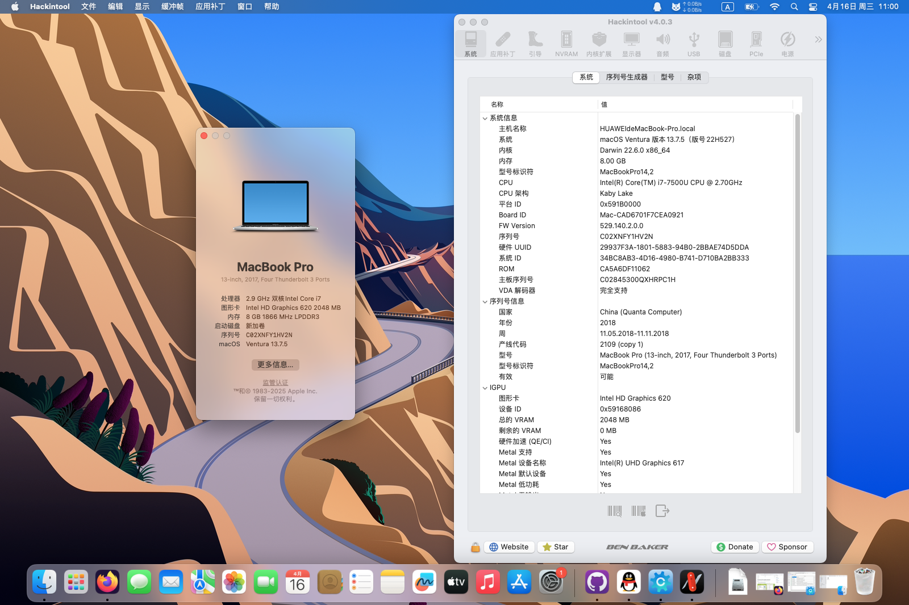

# HUAWEI-WT-W19-i7-7500U-Hackintosh
应用于华为MateBook X 2017(WT-W19)的OpenCore 1.0.4的黑苹果引导 支持macOS Ventura 13.7.5


注意：
- 此EFI不含三码 实际使用时请自行使用[OCAT](https://github.com/ic005k/OCAuxiliaryTools)生成
- config.plist已预先注入显示器EDID，如果安装后屏幕出现问题，可手动替换内置的EDID为你自己的EDID，或者使用"config-无EDID.plist"。
- 建议开启[HiDPI](https://github.com/xzhih/one-key-hidpi)以解锁更多的分辨率选项


### 配置清单
|类型|型号|规格|
|---|---|---|
|CPU|Intel Core i7-7500U|2.70 GHz|
|内存|Micron MT52L512M64D4PQ-10 8GB×2|1866 MHz|
|SSD|LITEON CB1-SD512|512 GB|
|iGPU|Intel HD Graphics 620|2048 MB|
|Wi-Fi|Intel Wi-Fi AC-8275|m.2|
|声卡|RealTek ALC298|立体声|
|操作系统|macOS Mojave-Ventura|10.14.0-13.7.5|
|BIOS|HUAWEI UEFI|1.03|

#### 无法工作的部分
- 隔空投送和接力：需要更换博通WI-FI网卡，部分型号需要搭配[AirportBrcmFixup](https://github.com/acidanthera/AirportBrcmFixup)驱动使用。
- USB Type-C分屏：未解决
- DRM硬解：无解

#### 附注事项
- 需要关闭CFG Lock，你可以在[这里](https://consumer.huawei.com/cn/support/driver-list/)下载并更新最新版的BIOS，并在Grub Shell里输入以下指令：
```
setup_var 0x3C 0x00
```
- 盒盖睡眠唤醒正常，休眠唤醒未测试。如果出现睡死问题，可尝试在终端里输入以下命令以关闭睡眠功能：
```
sudo pmset -a sleep 0
sudo pmset -a hibernatemode 0
sudo pmset -a disablesleep 1
```
- 此EFI理论可兼容**High Sierra和Sonoma-Sequoia**系列的macOS，但目前未做进一步测试。